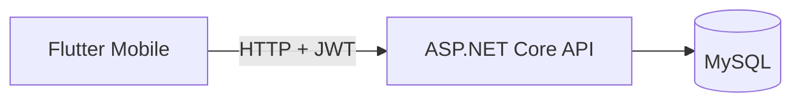

# FlowTask ✅

> Aplicativo full stack de produtividade com autenticação segura, organização de tarefas e dashboard de acompanhamento.

[](https://github.com/gabrielogutierrez/FlowTask/actions/workflows/ci.yml)


O **FlowTask** é uma aplicação mobile full stack construída para demonstrar um fluxo real de ponta a ponta: aplicativo Flutter, API REST em ASP.NET Core, autenticação JWT, persistência em MySQL, testes automatizados e CI no GitHub Actions.

## 📸 Preview

<p align="center">
  
  
</p>

<p align="center">
  
  
</p>

## ✨ Destaques

- 🔐 Cadastro e login com autenticação JWT
- 👤 Saudação personalizada com o nome do usuário
- ✅ CRUD completo de tarefas por usuário
- 📝 Título, descrição, categoria, prioridade e data de vencimento
- 🔎 Busca por tarefas
- 🎯 Filtros por tarefas pendentes e concluídas
- 📊 Dashboard com percentual geral de conclusão
- 📅 Indicadores de tarefas para hoje
- ⚠️ Identificação de tarefas atrasadas
- 🚩 Contador de tarefas de alta prioridade
- 🎨 Prioridades com identificação visual por cores
- 🌙 Modo claro e escuro com preferência salva
- ✏️ Edição completa das tarefas
- 👆 Conclusão rápida por checkbox
- 🗑️ Exclusão por gesto de deslizar
- 📱 Interface responsiva com Material 3
- 🐳 Docker Compose para infraestrutura local
- 📚 Swagger para documentação da API
- 🧪 Testes automatizados no backend e no aplicativo
- ⚙️ CI com GitHub Actions

## 📱 Experiência do usuário

A tela principal funciona como um pequeno painel de produtividade. O usuário consegue visualizar o progresso geral, quantidade de tarefas pendentes e concluídas, compromissos do dia, itens atrasados e tarefas de alta prioridade.

As tarefas podem ser criadas e editadas com categoria, prioridade, descrição e data de vencimento. A interface também oferece busca, filtros rápidos e tema claro/escuro persistente.

## 🏗️ Arquitetura



## 🧰 Tecnologias

| Camada | Tecnologias |
|---|---|
| Mobile | Flutter, Dart, Material 3, SharedPreferences |
| Backend | C#, ASP.NET Core 8, Entity Framework Core |
| Dados | MySQL 8 |
| Qualidade | xUnit, Flutter Test, GitHub Actions |
| Segurança | JWT, PBKDF2, isolamento de dados por usuário |

## ▶️ Como executar

### Banco de dados

```bash
docker compose up -d
```

### API

```bash
cd backend
dotnet restore
dotnet run --project FlowTask.Api
```

A documentação Swagger fica disponível em `/swagger` no ambiente de desenvolvimento.

### Aplicativo

```bash
cd mobile/flow_task
flutter pub get
flutter run
```

No emulador Android, o aplicativo usa `http://10.0.2.2:5000/api`. Para executar em outro dispositivo, ajuste `ApiClient.baseUrl`.

## 🔌 Endpoints principais

| Método | Endpoint | Função |
|---|---|---|
| POST | `/api/auth/register` | Criar conta |
| POST | `/api/auth/login` | Entrar |
| GET | `/api/tasks` | Listar, pesquisar e filtrar |
| POST | `/api/tasks` | Criar tarefa |
| PUT | `/api/tasks/{id}` | Editar tarefa |
| PATCH | `/api/tasks/{id}/toggle` | Concluir ou reabrir |
| DELETE | `/api/tasks/{id}` | Excluir tarefa |

## 🚀 Próximos passos

- Notificações locais de vencimento
- Sincronização offline
- Recuperação de senha
- Perfil e configurações do usuário
- Ampliação dos testes de integração
- Publicação da API
- Build Android para distribuição

---

Desenvolvido por [Gabriel Gutierrez](https://www.linkedin.com/in/gabriel-gutierrez-607607331).