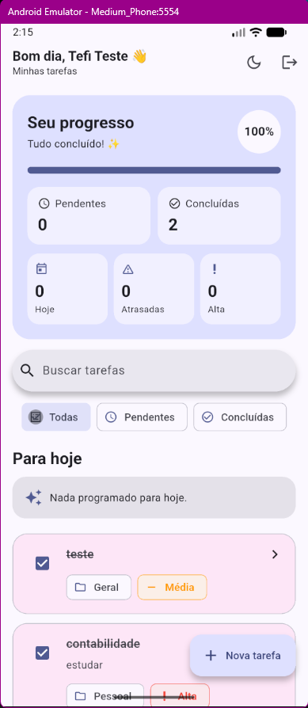
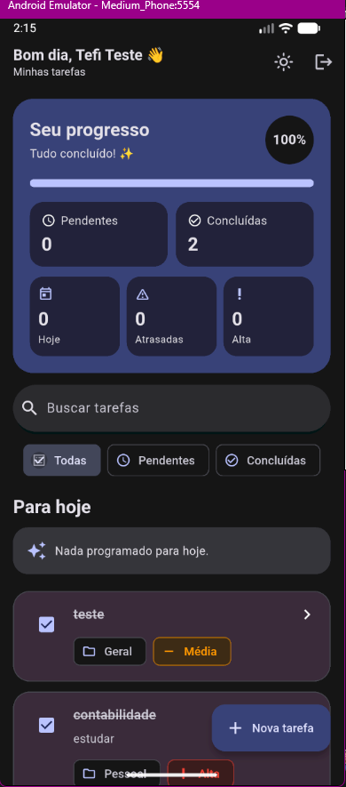
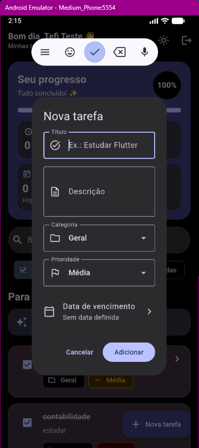
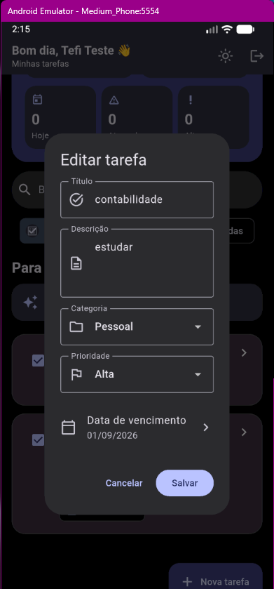
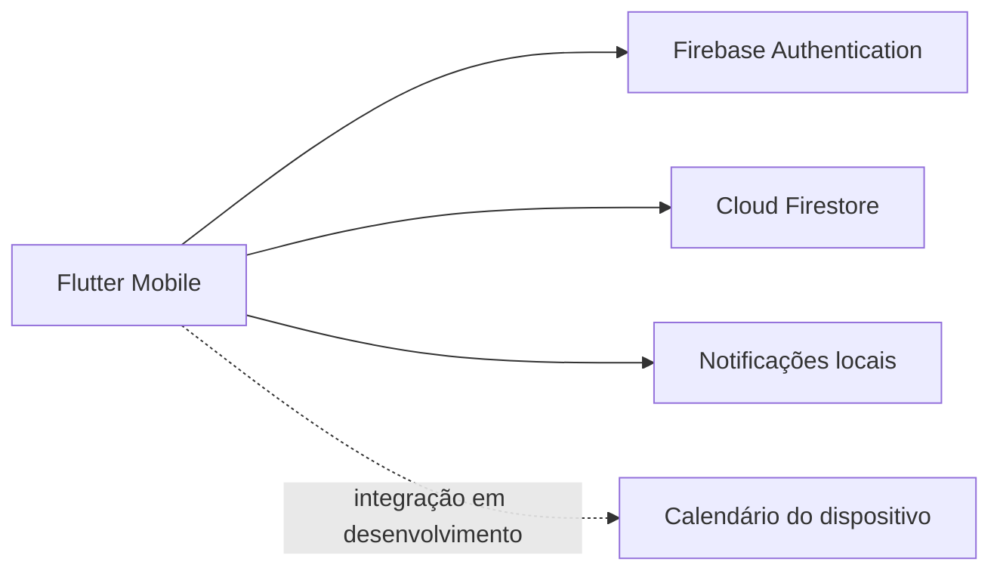

# FlowTask ✅

> Um planner mobile moderno para organizar tarefas, acompanhar o dia e transformar pequenas pendências em progresso visível.

[](https://github.com/gabrielogutierrez/FlowTask/actions/workflows/ci.yml)


O **FlowTask** é um aplicativo de produtividade desenvolvido em Flutter com foco em uma experiência leve, visual e prática. A versão atual utiliza **Firebase Authentication** para autenticação e **Cloud Firestore** para sincronização das tarefas em tempo real entre sessões.

O projeto começou como uma aplicação full stack com ASP.NET Core, MySQL e JWT. Esse backend continua no repositório como parte da evolução técnica do projeto, enquanto o aplicativo mobile atual segue uma arquitetura baseada em Firebase.

## 📸 Preview

<p align="center">
  
  
</p>

<p align="center">
  
  
</p>

> As telas do aplicativo continuam evoluindo. Novos screenshots serão adicionados conforme o design atual for consolidado.

## ✨ Funcionalidades atuais

- 🔐 Cadastro, login e sessão com Firebase Authentication
- ☁️ Tarefas armazenadas no Cloud Firestore
- ⚡ Atualização das tarefas em tempo real
- ✅ Criação, edição, conclusão, reabertura e exclusão de tarefas
- 📝 Título, descrição, categoria, prioridade e data
- ⏰ Horário personalizado de lembrete
- 🔔 Notificações locais agendadas no dispositivo
- 📅 Home em estilo planner com faixa de dias
- 🔎 Busca por tarefas
- 🎯 Filtros por todas, pendentes e concluídas
- 📊 Progresso geral de conclusão
- 🗂️ Histórico de tarefas concluídas
- ↩️ Restauração de tarefas pelo histórico
- 🌙 Modo claro e escuro com preferência persistente
- 👤 Tela de perfil e configurações
- 🖼️ Foto de perfil local no dispositivo
- 👁️ Opção para mostrar ou ocultar tarefas concluídas
- ⏱️ Horário padrão de lembrete configurável
- 🎨 Interface baseada em Material 3
- 📱 Layout pensado para uso mobile

## 🧪 Em desenvolvimento

- 📆 Sincronização de tarefas com o calendário do celular
- 🧩 Widget para tela inicial e tela de bloqueio
- 🔁 Tarefas recorrentes
- 🗓️ Calendário mensal completo dentro do FlowTask

## 📱 Experiência do usuário

A tela principal foi transformada em um planner diário. O usuário pode navegar pelos próximos dias, visualizar quantas tarefas existem em cada data, acompanhar o progresso geral e criar rapidamente uma tarefa já vinculada ao dia selecionado.

Quando um dia está vazio, o FlowTask mostra um estado visual mais leve com um atalho direto para adicionar uma nova tarefa. Busca, filtros e preferências completam a experiência sem exigir navegação excessiva.

## 🏗️ Arquitetura atual do aplicativo



O repositório também mantém o backend original em ASP.NET Core e MySQL, usado nas primeiras versões do FlowTask.

## 🧰 Tecnologias

| Área | Tecnologias |
|---|---|
| Mobile | Flutter, Dart, Material 3 |
| Autenticação | Firebase Authentication |
| Dados atuais | Cloud Firestore |
| Preferências locais | SharedPreferences |
| Notificações | flutter_local_notifications |
| Perfil | image_picker |
| Calendário | device_calendar_plus |
| Backend original | C#, ASP.NET Core 8, Entity Framework Core |
| Banco original | MySQL 8 |
| Qualidade | Flutter Test, xUnit, GitHub Actions |

## 📂 Estrutura principal

```text
FlowTask/
├── mobile/
│   └── flow_task/
│       ├── lib/
│       │   ├── models/
│       │   ├── screens/
│       │   └── services/
│       └── android/
├── backend/
├── docs/
└── README.md
```

## ▶️ Executando o aplicativo

### Requisitos

- Flutter instalado
- Android Studio ou emulador Android configurado
- Projeto Firebase configurado para Android

### Rodar o mobile

```bash
cd mobile/flow_task
flutter pub get
flutter run
```

Para utilizar Firebase em outro ambiente, configure o projeto Firebase correspondente e o arquivo `google-services.json` do aplicativo Android.

## 🖥️ Backend original

O backend ASP.NET Core permanece disponível no repositório como parte da versão full stack original.

### Banco de dados

```bash
docker compose up -d
```

### API

```bash
cd backend
dotnet restore
dotnet run --project FlowTask.Api
```

A documentação Swagger pode ser acessada em `/swagger` no ambiente de desenvolvimento.

## 🗺️ Roadmap

- [x] Firebase Authentication
- [x] Cloud Firestore em tempo real
- [x] Notificações locais
- [x] Perfil e configurações
- [x] Histórico de tarefas
- [x] Home estilo planner
- [ ] Finalizar sincronização com o calendário do dispositivo
- [ ] Criar tarefas recorrentes
- [ ] Criar calendário mensal completo
- [ ] Criar widgets para Android e iOS
- [ ] Recuperação de senha
- [ ] Revisar cobertura de testes
- [ ] Preparar builds para distribuição

## 🚧 Status

O **FlowTask está em desenvolvimento ativo**. A interface, integrações e experiência de uso continuam sendo refinadas a cada versão.

---

Desenvolvido por [Gabriel Gutierrez](https://www.linkedin.com/in/gabriel-gutierrez-607607331).