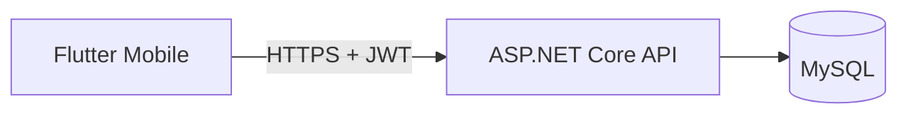

# FlowTask ✅

> Aplicativo full stack de produtividade com autenticação segura e organização de tarefas.

[](https://github.com/GeGekuuhaku/FlowTask/actions/workflows/ci.yml)


O **FlowTask** demonstra uma aplicação real de ponta a ponta: app Flutter, API REST em ASP.NET Core, autenticação JWT, persistência em MySQL e testes automatizados.

## Destaques

- Cadastro e login com JWT
- Senhas protegidas com PBKDF2 e salt individual
- CRUD de tarefas por usuário
- Categorias, prioridades, prazos, busca e filtros
- Interface Material 3 responsiva
- Swagger, health check, Docker Compose e CI no GitHub Actions
- Testes unitários no backend e no aplicativo

## Arquitetura



## Tecnologias

| Camada | Tecnologias |
|---|---|
| Mobile | Flutter, Dart, Material 3 |
| Backend | C#, ASP.NET Core 8, Entity Framework Core |
| Dados | MySQL 8 |
| Qualidade | xUnit, Flutter Test, GitHub Actions |
| Segurança | JWT, PBKDF2, isolamento por usuário |

## Como executar

### Banco de dados

```bash
docker compose up -d
```

### API

```bash
cd backend
dotnet restore
dotnet run --project FlowTask.Api
```

A documentação Swagger fica disponível em `/swagger` no ambiente de desenvolvimento.

### Aplicativo

```bash
cd mobile/flow_task
flutter pub get
flutter run
```

No emulador Android, o app usa `http://10.0.2.2:5000/api`. Ajuste `ApiClient.baseUrl` para outro dispositivo.

## Endpoints principais

| Método | Endpoint | Função |
|---|---|---|
| POST | `/api/auth/register` | Criar conta |
| POST | `/api/auth/login` | Entrar |
| GET | `/api/tasks` | Listar, pesquisar e filtrar |
| POST | `/api/tasks` | Criar tarefa |
| PUT | `/api/tasks/{id}` | Editar tarefa |
| PATCH | `/api/tasks/{id}/toggle` | Concluir ou reabrir |
| DELETE | `/api/tasks/{id}` | Excluir tarefa |

## Próximos passos

- Notificações de vencimento
- Sincronização offline
- Publicação da API e builds Android/iOS

---

Desenvolvido por [Gabriel Gutierrez](https://www.linkedin.com/in/gabriel-gutierrez-607607331).